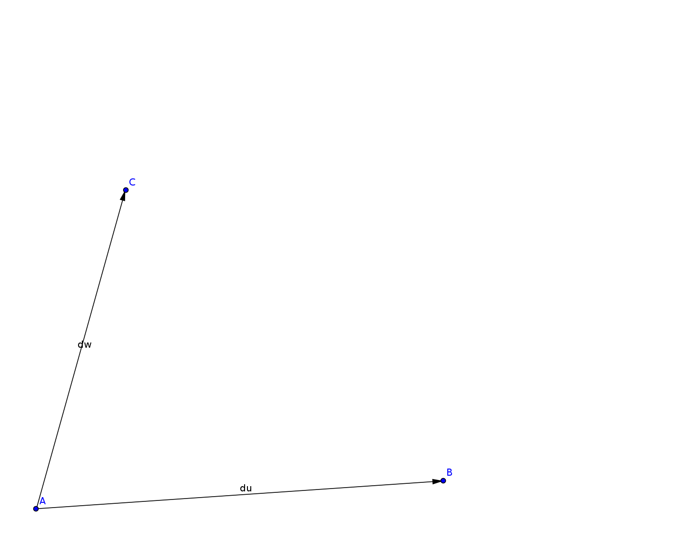
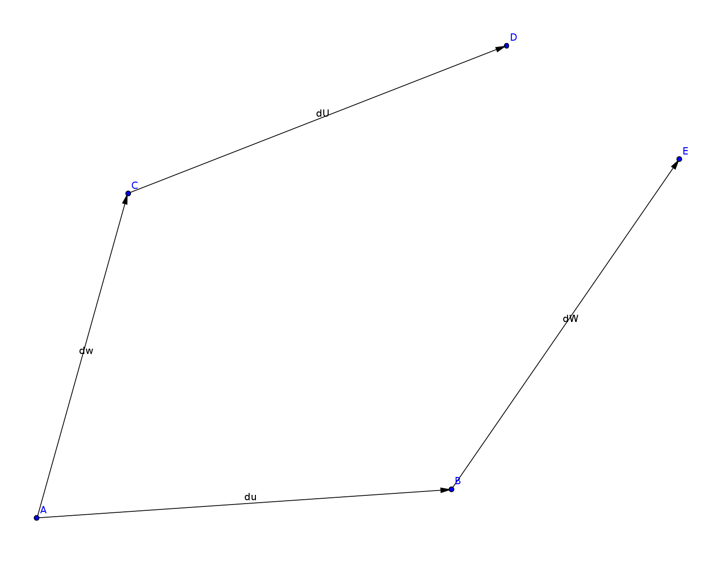
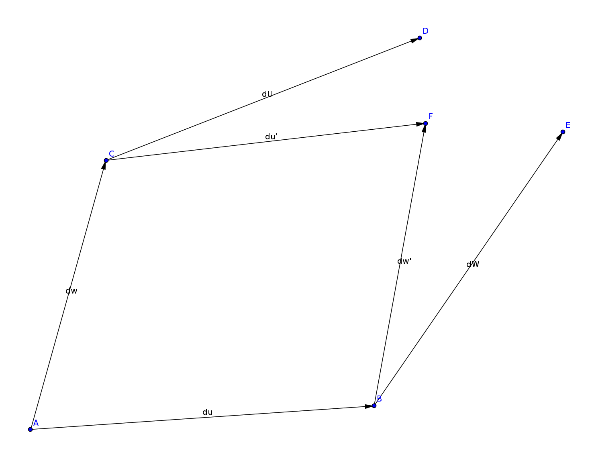
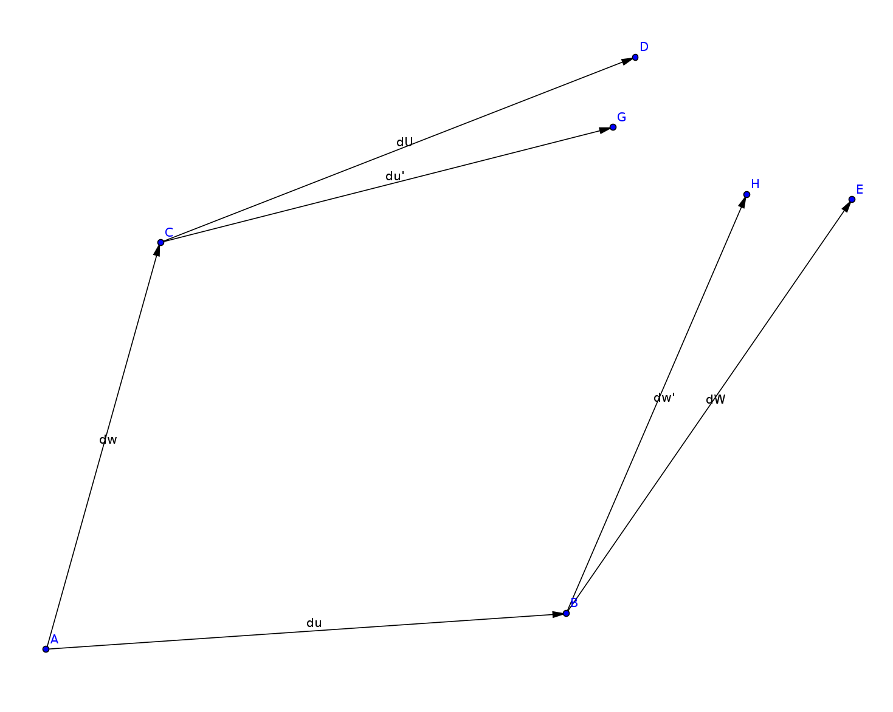
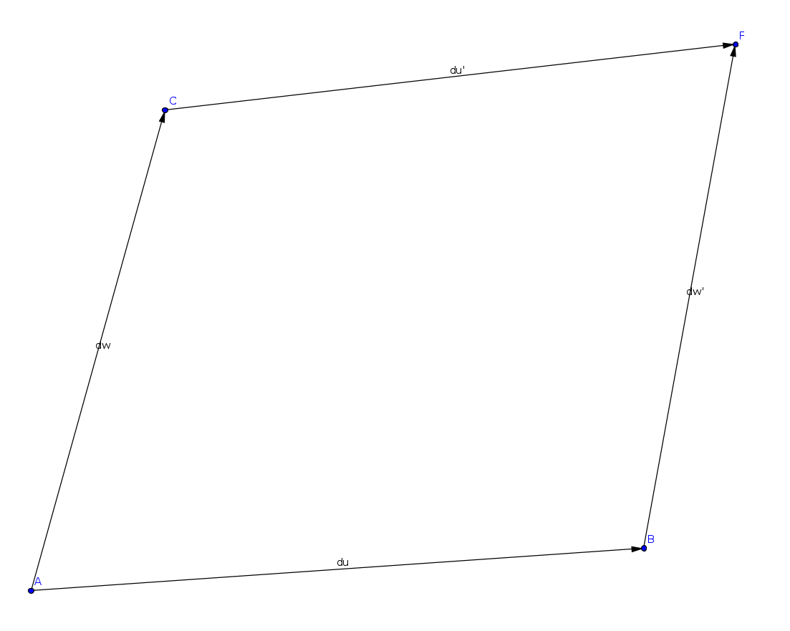
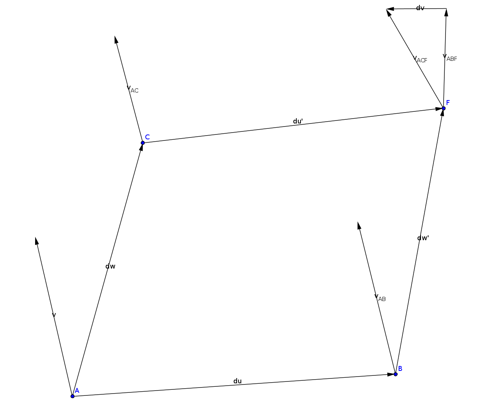

# Riemann Curvature Tensor

- In flat space, each point can be identified with a position vector
- The position of a point given a position vector from another point is the sum of those position vectors
- In curved space, we cannot identify points in space with position vectors 
- However, each point in space can be treated as flat locally, so that points
can be indicated with a position vector originating from another point that is close by

---

- Let the vector $\delta \vec{u}$ points from point $A$ to neighboring point $B$
- Let the vector $\delta \vec{w}$ points from point $A$ to neighboring point $C$

{.img-med}

---

- Vector $\delta \vec{u}$ at point $C$, locates the neighboring point $D$
- Vector $\delta \vec{w}$ at point $B$, locates the neighboring point $E$
- $E$ is close to $B$, $D$ is close to $C$, $B$ and $C$ are both close to $A$
- $E$ and $D$ are NOT close to $A$, and cannot be uniquely identified with a position vector from $A$ to $E$ or $D$

{.img-med}

---

- $\delta\vec{w}$ and $\delta\vec{u}$ are treated as close enough to be locally flat and indicate positions around $A$
- Their sum $\delta\vec{w}+\delta\vec{u}$ is long enough to need corrections, and does not uniquely identify a point in space
- In general for curved space, the points $D$ and $E$ do not coincide

{.img-med}

---

- We may parallel transport $\delta\vec{w}$ along $\delta\vec{u}$ resulting in 
a vector $\delta \vec{w}^{\prime}$ at point $B$ and vice versa for $\delta\vec{u}^{\prime}$ at point $C$.
- This compensates for the curvature of space and identifies a unique point in space $F$ independent of order IF 
space is torsionless
- In flat space, the point $F$ would just be identified with the position vector $\delta\vec{u}+\delta\vec{w}$
- Instead for curved torsionless space, we have $\delta \vec{u} + \delta{w}^{\prime}=\delta \vec{w} + \delta{u}^{\prime}$

{.img-med}

---

- If there is torsion, even $\delta \vec{w} +\delta\vec{u}^{\prime}$ and $\delta \vec{u} +\delta\vec{w}^{\prime}$ do not coincide to the same point

{.img-med}

---
- We will assume no torsion
- The lowest order correction from parallel transport is the gradient along the transport path vector

$$\delta\vec{u}^{\prime}=\delta\vec{u}+\nabla_{{\delta\vec{w}}}\delta\vec{u}\qquad
\delta\vec{w}^{\prime}=\delta\vec{w}+\nabla_{{\delta\vec{u}}}\delta\vec{w}$$

{.img-med}

---

- These two paths correspond to the same point $F$, but they do NOT correspond to the same tangent space AT $F$. 
- We can transport another vector $\vec{v}$ on the path $ABF$, and the path $ACF$ and compare the difference at point $F$

{.img-med}

$$
\vec{v}_{AC}=\vec{v}+\nabla_{\delta \vec{w}}\vec{v} \qquad
\vec{v}_{ACF}=\vec{v}_{AC}+\nabla_{\delta \vec{u}^{\prime}}\vec{v}_{AC}\qquad
\vec{v}_{AB}=\vec{v}+\nabla_{\delta \vec{u}}\vec{v}\qquad
\vec{v}_{ABF}=\vec{v}_{AB}+\nabla_{\delta \vec{w}^{\prime}}\vec{v}_{AB}
$$

$$
\implies\delta\vec{v}=\vec{v}_{ABF}-\vec{v}_{ACF}
=\left(1+\nabla_{\delta\vec{w}^{\prime}}\right){\vec{v}}_{AB}
-\left(1+\nabla_{\delta\vec{u}^{\prime}}\right){\vec{v}}_{AC}
=\left(1+\nabla_{\delta\vec{w}^{\prime}}\right)\left(1+\nabla_{\delta\vec{u}}\right)\vec{v}
-\left(1+\nabla_{\delta\vec{u}^{\prime}}\right)\left(1+\nabla_{\delta\vec{w}}\right)\vec{v}
$$

$$
\implies\delta\vec{v}=\left[
\left(1+\nabla_{\delta\vec{w}^{\prime}}\right)\left(1+\nabla_{\delta\vec{u}}\right)
-\left(1+\nabla_{\delta\vec{u}^{\prime}}\right)\left(1+\nabla_{\delta\vec{w}}\right)
\right]\vec{v}\\
$$

---

The Riemann tensor is defined by $\delta \vec{v}=R(\delta \vec{w}, \delta \vec{u})\vec{v}$.
We can calculate it up to the lowest surviving order ($\nabla_{\vec{a}+\vec{b}}=\nabla_{\vec{a}}+\nabla_{\vec{b}}$):

$$
\implies R(\delta \vec{w}, \delta \vec{u})=\left(1+\nabla_{\delta\vec{w}^{\prime}}\right)\left(1+\nabla_{\delta\vec{u}}\right)
-\left(1+\nabla_{\delta\vec{u}^{\prime}}\right)\left(1+\nabla_{\delta\vec{w}}\right)
=\left(1+\nabla_{\delta\vec{w}+\nabla_{\delta\vec{u}}\delta\vec{w}}\right)\left(1+\nabla_{\delta\vec{u}}\right)
-\left(1+\nabla_{\delta\vec{u}+\nabla_{\delta\vec{w}}\delta\vec{u}}\right)\left(1+\nabla_{\delta\vec{w}}\right)\\
$$

$$
=\left(1+\nabla_{\delta\vec{w}}+\nabla_{\nabla_{\delta\vec{u}}\delta\vec{w}}\right)\left(1+\nabla_{\delta\vec{u}}\right)\\
-\left(1+\nabla_{\delta\vec{u}}+\nabla_{\nabla_{\delta\vec{w}}\delta\vec{u}}\right)\left(1+\nabla_{\delta\vec{w}}\right)
=\nabla_{\delta\vec{w}}\nabla_{\delta\vec{u}}-\nabla_{\delta\vec{u}}\nabla_{\delta\vec{w}}
+\nabla_{\nabla_{\delta \vec{u}}\delta\vec{w}}-\nabla_{\nabla_{\delta\vec{w}}\delta\vec{u}} + O(\delta^3)\\
$$

$$
\approx\nabla_{\delta\vec{w}}\nabla_{\delta\vec{u}}-\nabla_{\delta\vec{u}}\nabla_{\delta\vec{w}}
+\nabla_{\nabla_{\delta \vec{u}}\delta\vec{w}}-\nabla_{\nabla_{\delta\vec{w}}\delta\vec{u}}
=\nabla_{\delta\vec{w}}\nabla_{\delta\vec{u}}-\nabla_{\delta\vec{u}}\nabla_{\delta\vec{w}}
-\nabla_{\left(\nabla_{\delta\vec{w}}\delta\vec{u} - \nabla_{\delta\vec{u}}\delta\vec{w}\right)}
$$

The Lie bracket of two vectors yields another vector defined by $\vec{\mathcal{L}}(\vec{a}, \vec{b})=\nabla_{\vec{a}}\vec{b}-\nabla_{\vec{b}}\vec{a}$,
giving us our final result:

$$
\implies \boxed{R(\delta\vec{w}, \delta\vec{u})
=\left[\nabla_{\delta\vec{w}}, \nabla_{\delta\vec{u}}\right]
-\nabla_{\vec{\mathcal{L}}(\delta \vec{w}, \delta \vec{u})}}
$$

